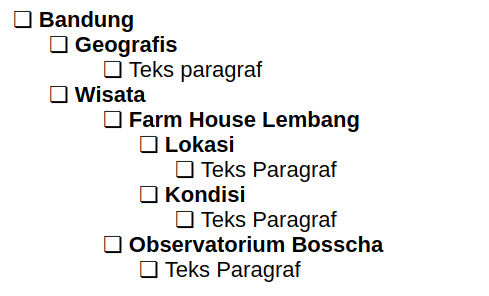
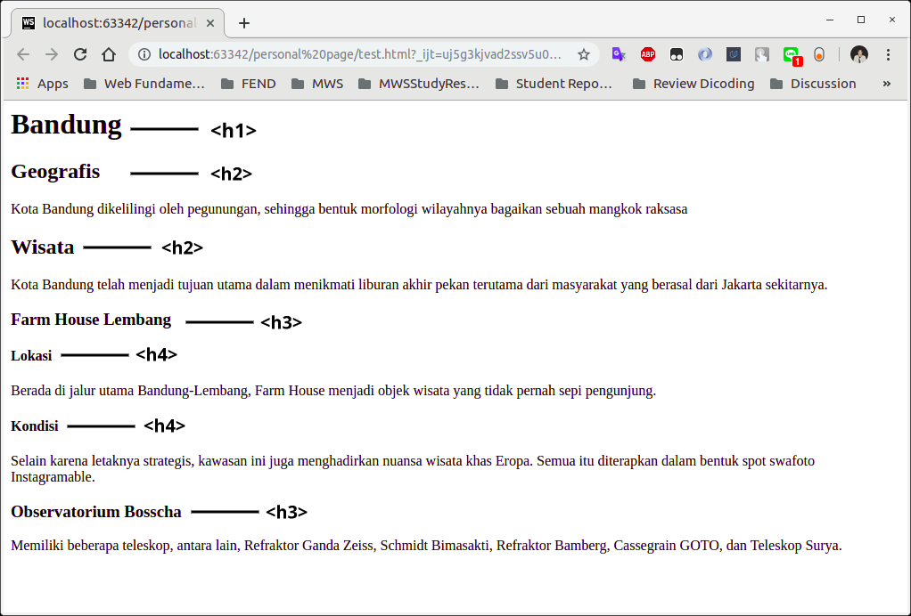

---
tags:
  - web-development
  - html
  - dicoding
---
## Heading

Pada modul sebelumnya, kita sudah melihat contoh penggunaan heading yang diterapkan pada konten yang kita siapkan. Kita menggunakan <h1> dan <h2> dalam mengindikasi judul dan subjudul pada kontennya. Pada HTML, ada elemen <h1> hingga <h6> elemen heading yang dapat kita gunakan.

Ketika kita menambahkan heading pada konten, ia merepresentasikan garis besar halaman pada sebuah browser. Alat bantu baca seperti _screen reader_ membaca garis besar halaman untuk bantu memetakan dan mengarahkan pengguna selama menjelajahi halaman. Selain itu, heading juga merupakan elemen yang dicari oleh mesin pencarian, contohnya Google Search.

Ini contoh penerapan heading empat level pada sebuah dokumen. Tiap level heading dituliskan dengan cara yang sama.

```html
<h1>Bandung</h1>

<h2>Geografis</h2>
<p>
  Kota Bandung dikelilingi oleh pegunungan, sehingga bentuk morfologi wilayahnya bagaikan sebuah mangkok raksasa
</p>

<h2>Wisata</h2>
<p>
  Kota Bandung telah menjadi tujuan utama dalam menikmati liburan akhir pekan terutama dari masyarakat yang berasal dari Jakarta sekitarnya.
</p>

<h3>Farm House Lembang</h3>
<h4>Lokasi</h4>
<p>
  Berada di jalur utama Bandung-Lembang, Farm House menjadi objek wisata yang tidak pernah sepi pengunjung.
</p>

<h4>Kondisi</h4>
<p>
  Berada di jalur utama Bandung-Lembang, Farm House menjadi objek wisata yang tidak pernah sepi pengunjung. Selain karena letaknya strategis, kawasan ini juga menghadirkan nuansa wisata khas Eropa. Semua itu diterapkan dalam bentuk spot swafoto Instagramable.
</p>
```

*(Preview Interaktif CodeSandbox)*
<iframe src="https://codesandbox.io/embed/jgth35?fontsize=14&hidenavigation=1&theme=dark&view=preview"
     style="width:100%; height:500px; border:0; border-radius: 8px; overflow:hidden; margin: 15px 0;"
     title="Contoh Heading"
     allow="accelerometer; ambient-light-sensor; camera; encrypted-media; geolocation; gyroscope; hid; microphone; midi; payment; usb; vr; xr-spatial-tracking"
     sandbox="allow-forms allow-modals allow-popups allow-presentation allow-same-origin allow-scripts"
></iframe>

Dari penggunaan elemen heading pada konten tersebut maka kita bisa membuat garis besar dokumen seperti berikut.



Pada browser, standarnya heading akan ditampilkan dengan tulisan **tebal** (_bolded text_), dimulai dari h1 dengan ukuran teks paling besar kemudian berurutan sesuai dengan _level heading-_nya.

